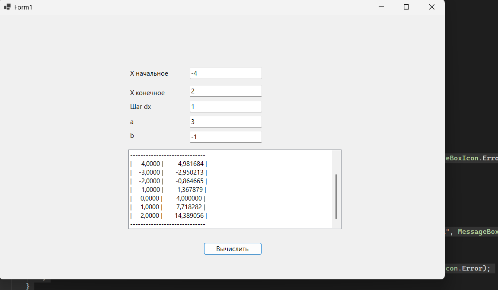

# Практическая работа №22 #

### Цель: изучить простейшие средства отладки программ в среде Visual Studio. Составить и отладить программу циклического алгоритма.  ###  

#### Ход работы ####

##### Вариант: 11 #####
##### Код программы: #####
```cs
        namespace WinFormsApp1
{
    public partial class Form1 : Form
    {
        public Form1()
        {
            InitializeComponent();
        }

        private void label1_Click(object sender, EventArgs e)
        {

        }

        private void button1_Click(object sender, EventArgs e)
        {
            try
            {
               
                double x0 = Convert.ToDouble(textBox1.Text);
                double xk = Convert.ToDouble(textBox2.Text);
                double dx = Convert.ToDouble(textBox3.Text);
                double a = Convert.ToDouble(textBox4.Text);
                double b = Convert.ToDouble(textBox5.Text); 

                
                listBox1.Items.Clear();

                
                listBox1.Items.Add("Результаты табулирования:");
                listBox1.Items.Add("-----------------------------");
                listBox1.Items.Add($"| {"X",10} | {"Y",15} |");
                listBox1.Items.Add("-----------------------------");


                double x = x0;


                double epsilon = Math.Abs(dx) / 1000.0; 
                if (dx > 0)
                {
                    while (x <= xk + epsilon)
                    {
                        
                        double y = 2 * x + a - b * Math.Exp(x);

                        string line = $"| {x,10:F4} | {y,15:F6} |";
                        listBox1.Items.Add(line);

                        x += dx;
                    }
                }
                else if (dx < 0)
                {
                    while (x >= xk - epsilon)
                    {
                        
                        double y = 2 * x + a - b * Math.Exp(x);

                        
                        string line = $"| {x,10:F4} | {y,15:F6} |";
                        listBox1.Items.Add(line);

                        x += dx; 
                    }
                }
                else
                {
                    MessageBox.Show("Шаг dx не может быть равен нулю!", "Ошибка", MessageBoxButtons.OK, MessageBoxIcon.Error);
                    return;
                }

                listBox1.Items.Add("-----------------------------");
            }
            catch (FormatException)
            {
                MessageBox.Show("Пожалуйста, введите корректные числовые значения во все поля.", "Ошибка ввода", MessageBoxButtons.OK, MessageBoxIcon.Warning);
            }
            catch (Exception ex)
            {
                MessageBox.Show($"Произошла ошибка: {ex.Message}", "Ошибка", MessageBoxButtons.OK, MessageBoxIcon.Error);
            }
        }
    }
}

```

Скриншоты:  

##### Вывод по проделанной работе: #####
> изучил простейшие средства отладки программ в среде Visual Studio. Составил и отладил программу циклического алгоритма.